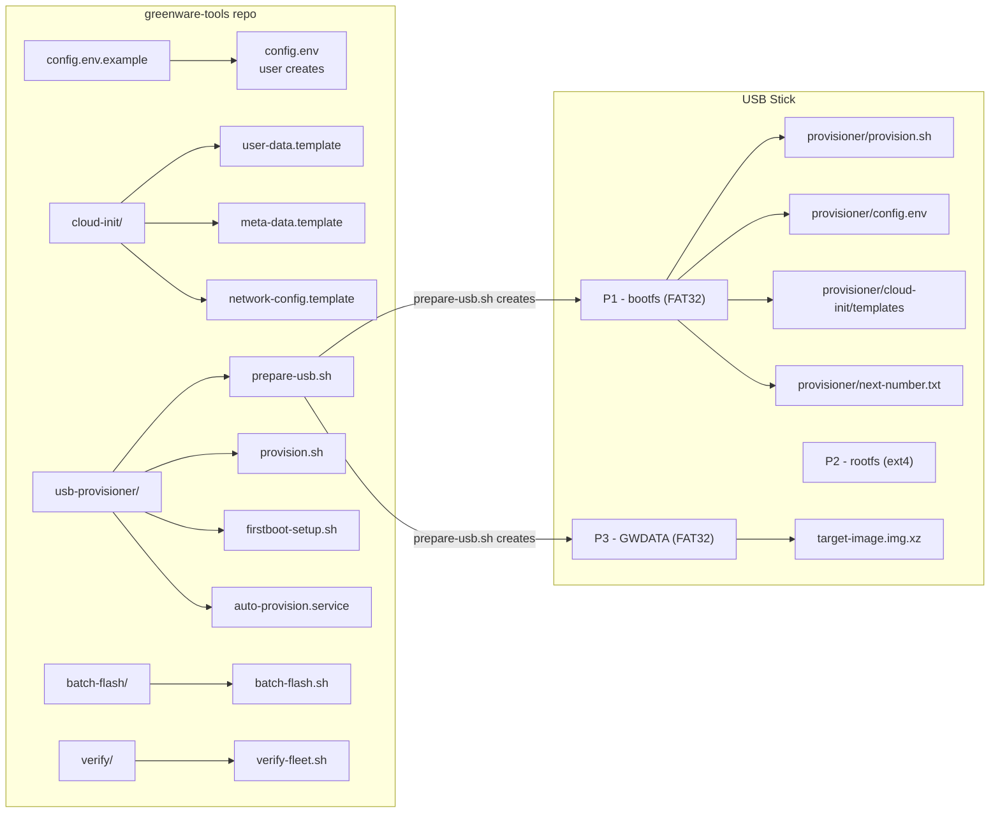
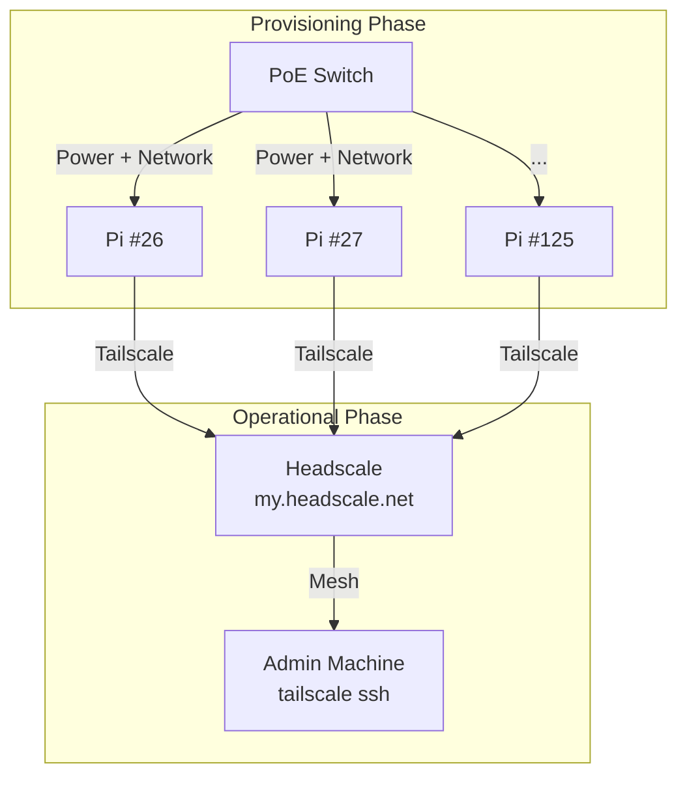

# Architecture

## Provisioning Workflow

Two approaches are available. Both produce identically-configured Pis.

### USB Provisioner (On-Device)

```mermaid
sequenceDiagram
    participant Op as Operator
    participant Pi as Raspberry Pi
    participant USB as USB Stick
    participant SD as microSD Card
    participant HS as Headscale

    Op->>SD: Insert blank microSD
    Op->>USB: Plug USB stick into Pi
    Op->>Pi: Connect PoE Ethernet (powers on)

    Pi->>Pi: EEPROM checks SD boot → fails
    Pi->>USB: Falls through to USB boot
    USB->>Pi: Boots Raspberry Pi OS from USB
    Pi->>Pi: systemd starts auto-provision.service

    rect rgb(40, 40, 60)
      Note over Pi,SD: provision.sh executes
      Pi->>SD: dd flash OS image
      Pi->>SD: Expand root partition
      Pi->>SD: Mount boot partition
      Pi->>SD: Write user-data (hostname, SSH, Tailscale)
      Pi->>SD: Write meta-data (instance-id)
      Pi->>SD: Write network-config (DHCP)
      Pi->>USB: Increment counter file
    end

    Pi->>Pi: LED blinks rapidly (success)
    Op->>Pi: Disconnect PoE → Remove USB
    Op->>Pi: Reconnect PoE

    Pi->>SD: Boots from microSD
    SD->>Pi: cloud-init runs

    rect rgb(40, 60, 40)
      Note over Pi,HS: First boot configuration
      Pi->>Pi: Set hostname
      Pi->>Pi: Create admin user + SSH key
      Pi->>Pi: Install Tailscale
      Pi->>HS: tailscale up → join tailnet
      Pi->>Pi: Redact auth key from config
    end

    Pi->>HS: Online on tailnet ✅
```

### Batch Flash (macOS)

```mermaid
sequenceDiagram
    participant Op as Operator
    participant Mac as macOS
    participant SD as microSD Card
    participant Pi as Raspberry Pi
    participant HS as Headscale

    Op->>SD: Insert SD into card reader
    Op->>Mac: Press Enter in batch-flash.sh

    rect rgb(40, 40, 60)
      Note over Mac,SD: batch-flash.sh executes
      Mac->>SD: dd flash OS image
      Mac->>SD: Mount boot (FAT32) partition
      Mac->>SD: Write user-data
      Mac->>SD: Write meta-data
      Mac->>SD: Write network-config
      Mac->>SD: Eject
    end

    Op->>SD: Remove SD, label it
    Op->>Pi: Insert SD into Pi
    Op->>Pi: Connect PoE Ethernet

    Pi->>SD: Boots from microSD
    SD->>Pi: cloud-init runs

    rect rgb(40, 60, 40)
      Note over Pi,HS: First boot configuration
      Pi->>Pi: Set hostname
      Pi->>Pi: Create admin user + SSH key
      Pi->>Pi: Install Tailscale
      Pi->>HS: tailscale up → join tailnet
      Pi->>Pi: Redact auth key
    end

    Pi->>HS: Online on tailnet ✅
```

## File Layout

## Network Topology

